# Kibana

⚠️ A traduire en Anglais !<br/>

Une application Web qui se branche sur un custer elasticsearch.<br/>
Elle permet de faire tout ce qui est possible de faire via l'API REST c'est à dire des recherches, des aggrégations mais aussi de créer des diagrammes de visualisation et des dashboards. Elle permet aussi de monitorer le cluster.<br/>
Chez nos clients on l'uitilse souvent pour de l'analyse de logs.<br/>
On peut également l'utiliser pour l'analyse de click stream, d'ou vient le traffic sur mon site web, qui génére tel type d'erreurs, etc...

Ce qui fait que Elasticsearch n'est plus juste un outil de recherche, il est aussi un puissant couteau suisse pour faire de l'analytique.

### Install Java 8
```console sbtshell
sudo yum install java-1.8.0-openjdk-devel
```

### Install Elasticsearch 7
```console sbtshell
Import the public key of elasticsearch :

sudo rpm --import https://artifacts.elastic.co/GPG-KEY-elasticsearch

sudo nano /etc/yum.repos.d/elasticsearch.repo
[elasticsearch-7.x]
name=Elasticsearch repository for 7.x packages
baseurl=https://artifacts.elastic.co/packages/7.x/yum
gpgcheck=1
gpgkey=https://artifacts.elastic.co/GPG-KEY-elasticsearch
enabled=1
autorefresh=1
type=rpm-md

sudo yum install -y elasticsearch

sudo nano /etc/elasticsearch/elasticsearch.yml
node.name: node-1
network.host: 0.0.0.0
discovery.seed_hosts: ["127.0.0.1"]
cluster.initial_master_nodes: ["node-1"]
xpack.security.enabled: false
```

### Run Elasticsearch :
```console sbtshell
sudo systemctl start elasticsearch.service
```

Check the version : 
```console sbtshell
curl -XGET 'localhost:9200'
```

### Install Kibana
```console sbtshell
sudo yum install -y kibana

sudo nano /etc/kibana/kibana.yml
server.host: "0.0.0.0"

sudo systemctl start kibana.service
```

## Let's play with Kibana

⚠️ Kibana is launched on port 5601

<p align="center">
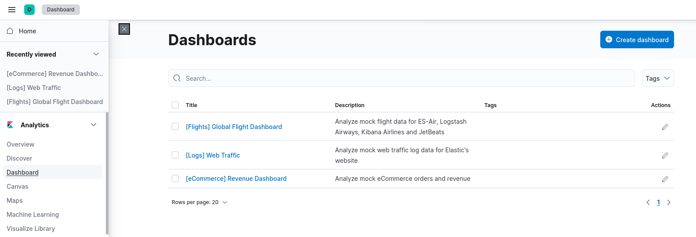
</p>
<p align="center">
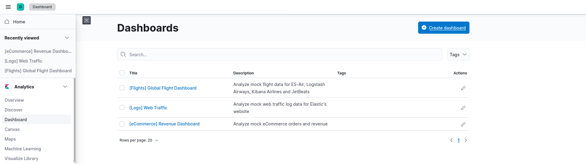
</p>
<p align="center">
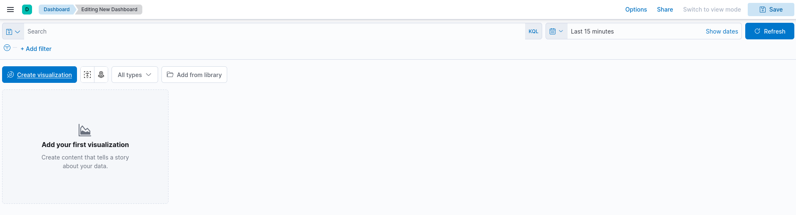
</p>
<p align="center">
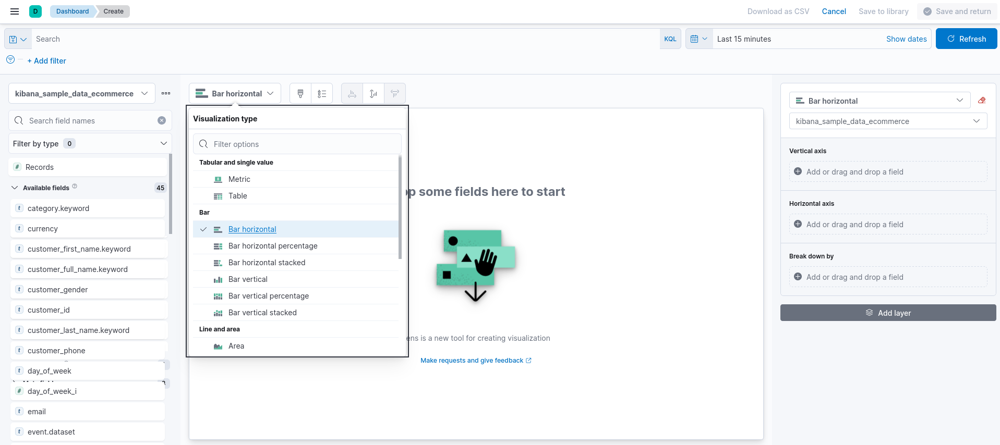
</p>
<p align="center">
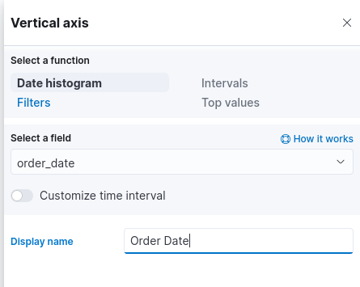
</p>
<p align="center">
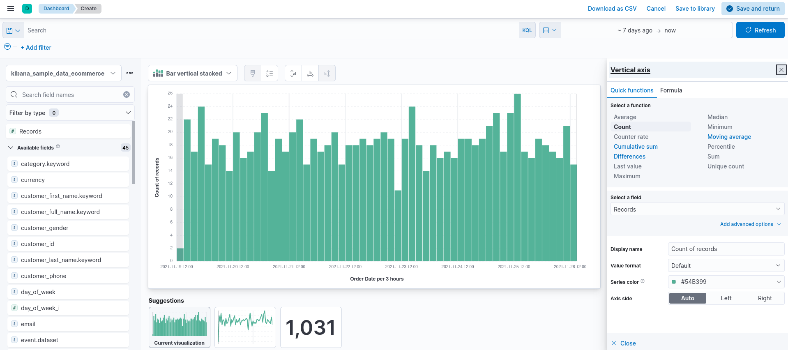
</p>
<p align="center">
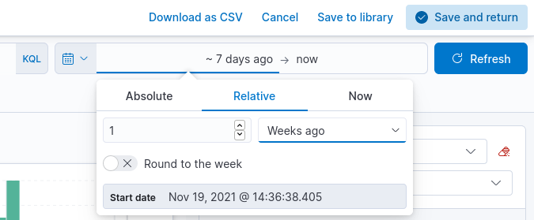
</p>
<p align="center">
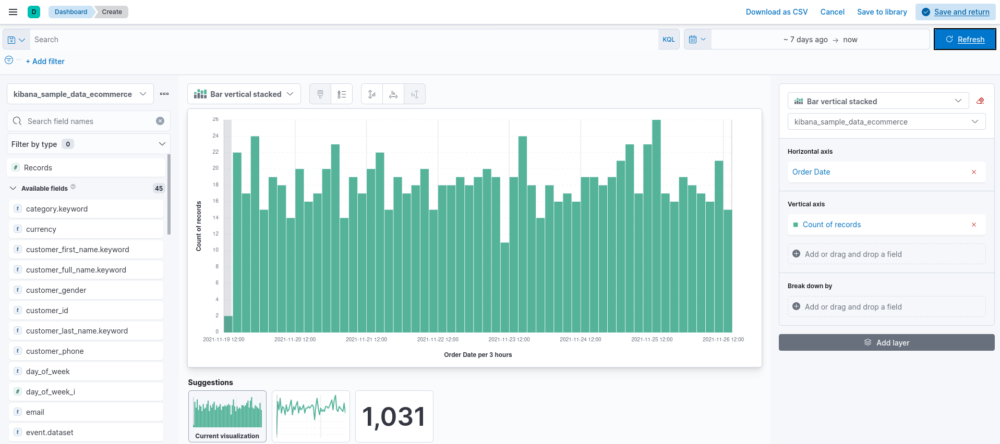
</p>
<p align="center">
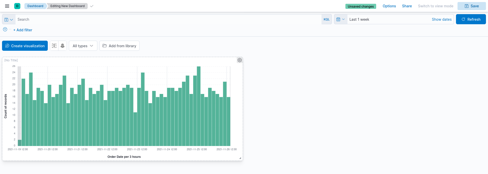
</p>
<p align="center">
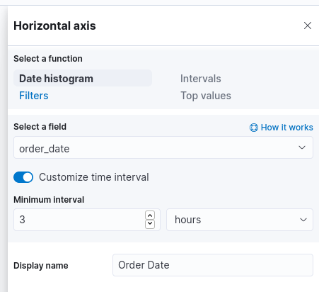
</p>
<p align="center">
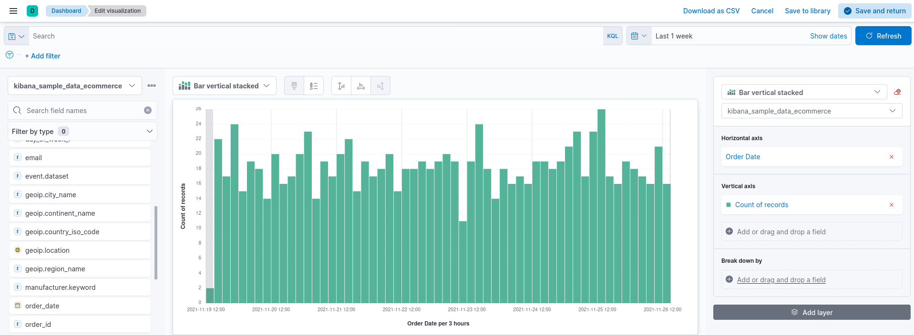
</p>
<p align="center">
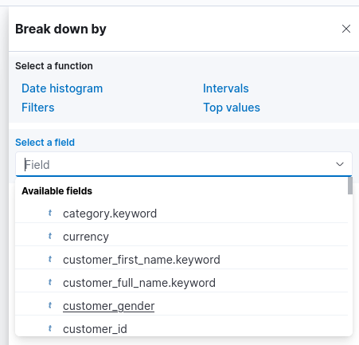
</p>
<p align="center">
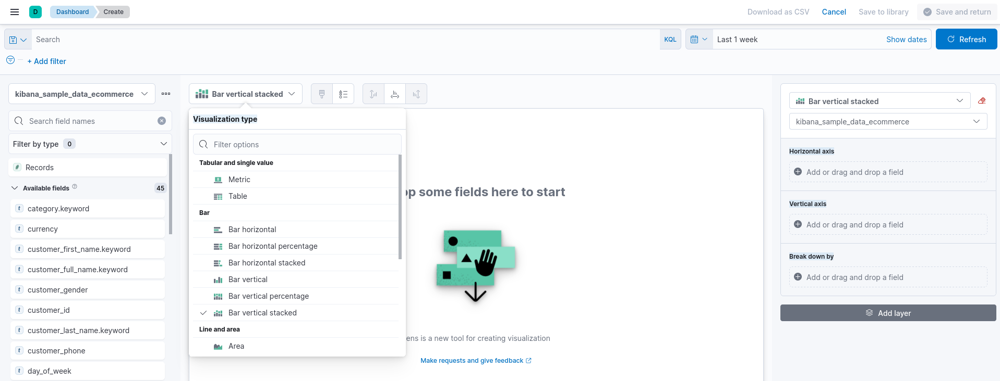
</p>
<p align="center">
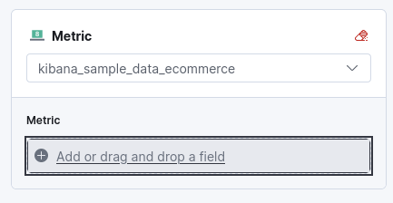
</p>
<p align="center">
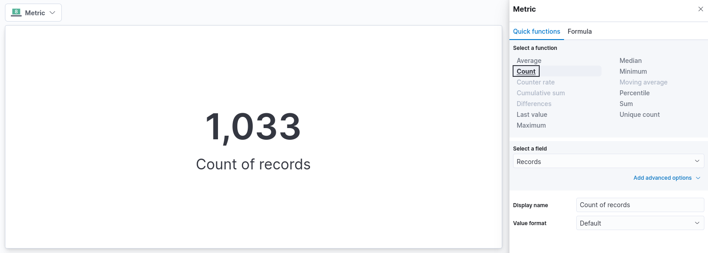
</p>
<p align="center">
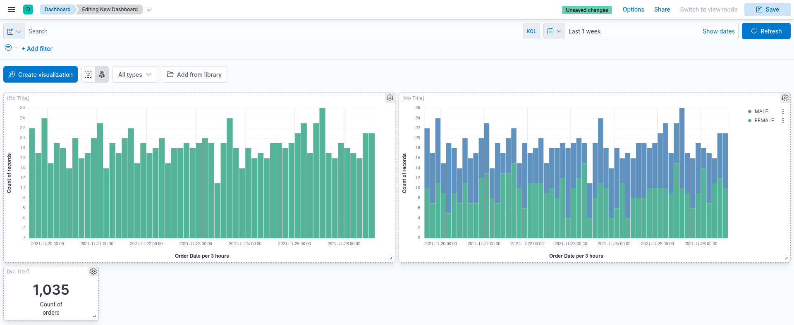
</p>
<p align="center">
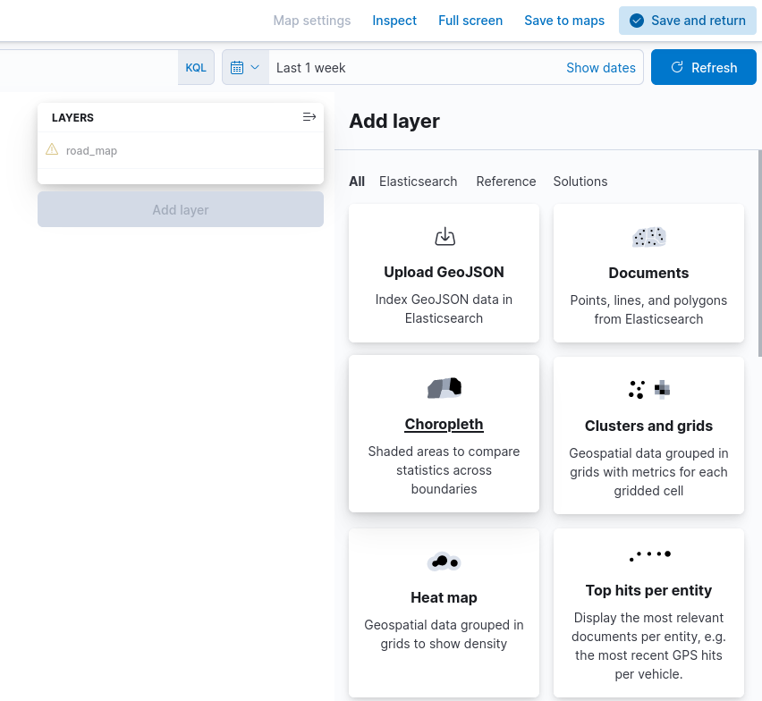
</p>
<p align="center">
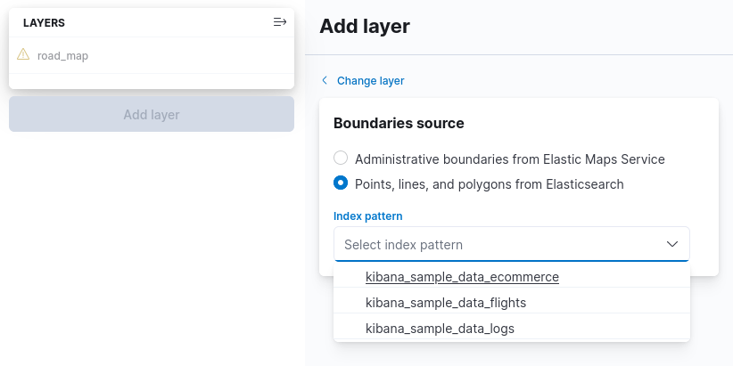
</p>
<p align="center">
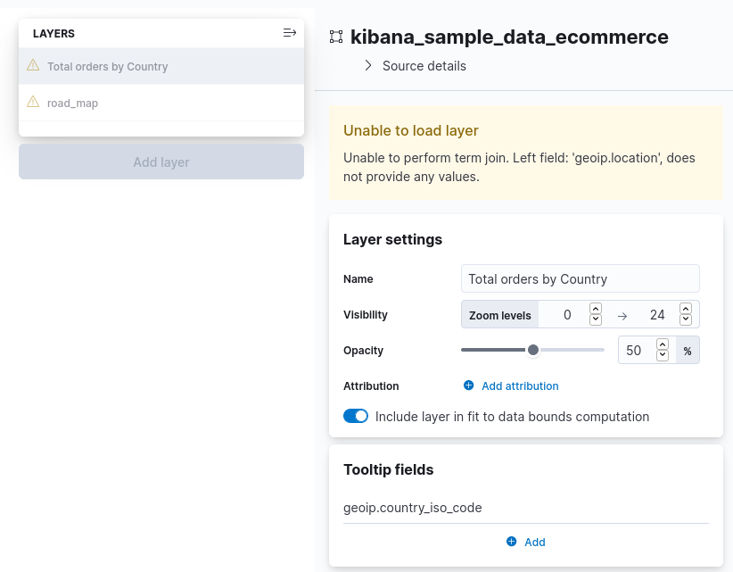
</p>
<p align="center">
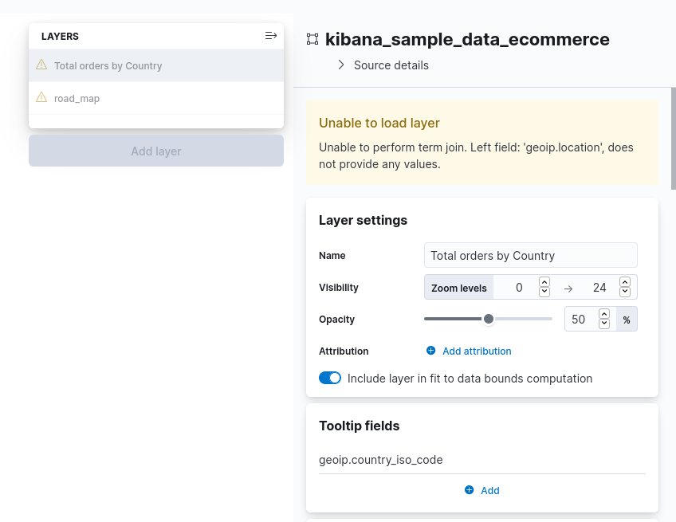
</p>
<p align="center">
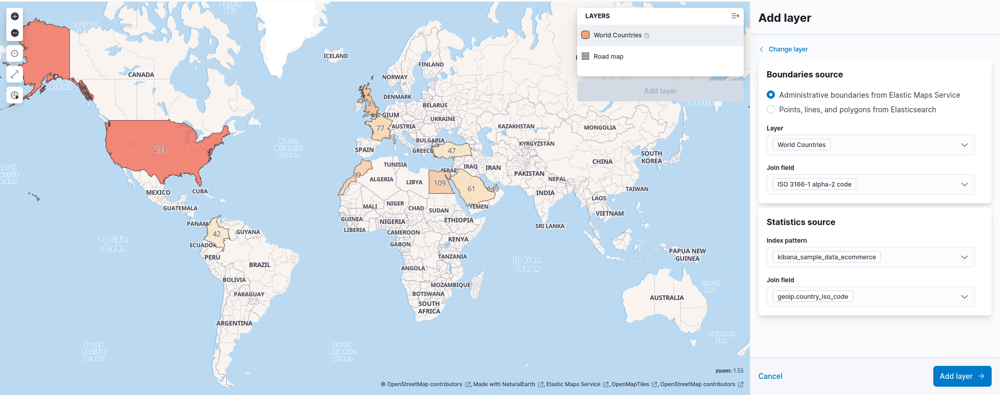
</p>
<p align="center">
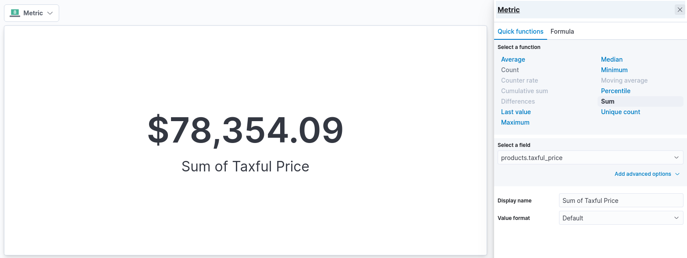
</p>
<p align="center">
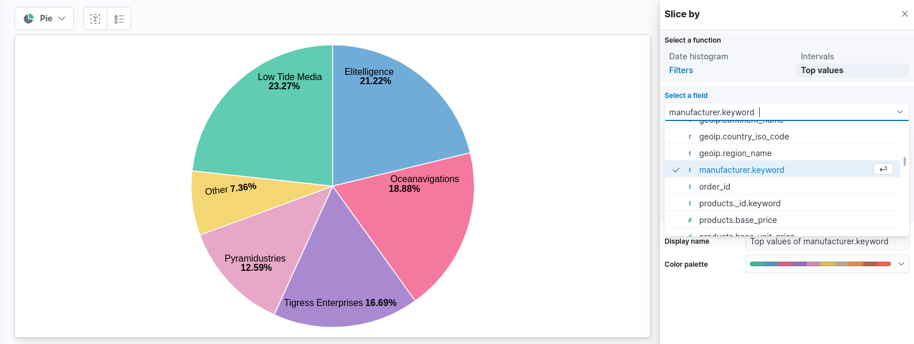
</p>
<p align="center">
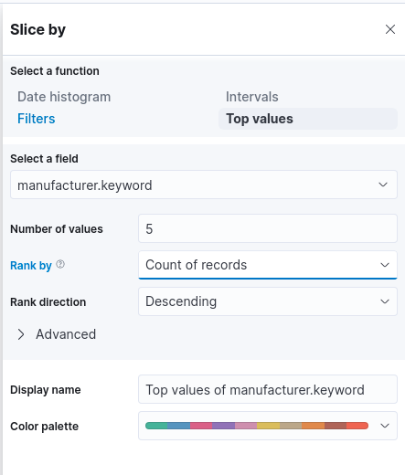
</p>
<p align="center">
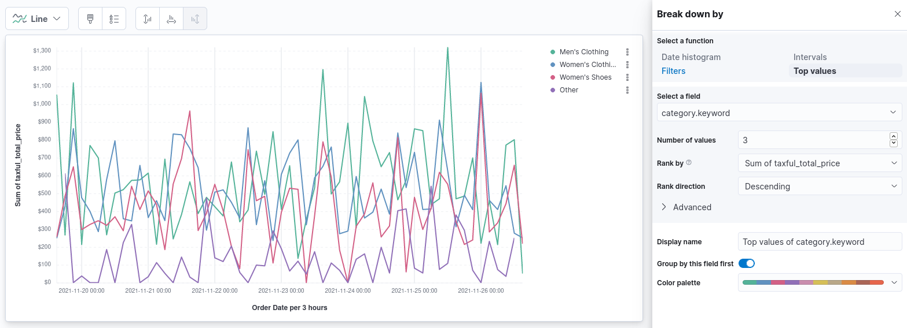
</p>
<p align="center">
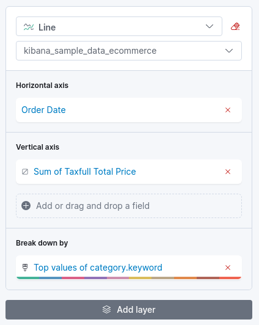
</p>
<p align="center">
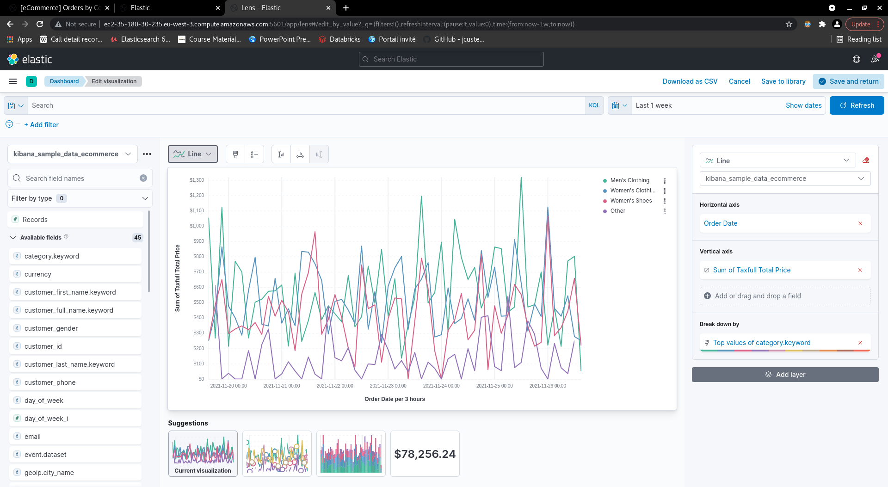
</p>
<p align="center">
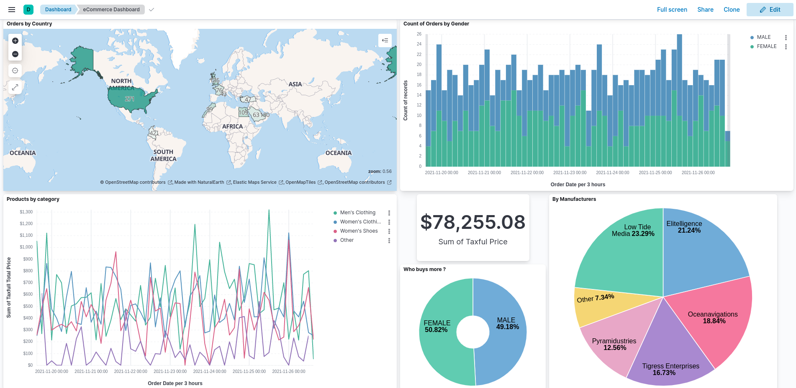
</p>


