# First Part : Presentation

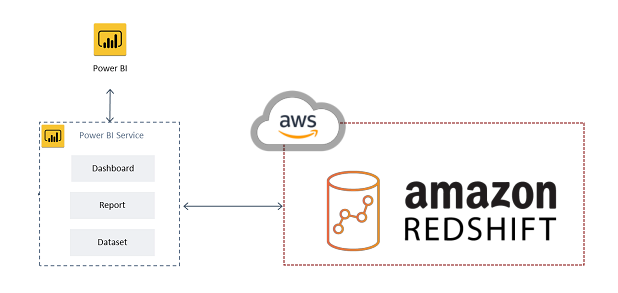

## Power BI :

Power BI is Microsoft's Business Intelligence and Data Analysis tool.
It is an indispensable business analytics that facilitates effective visualization and analysis of data.
Microsoft Power BI is completely free tool, that provides effective analyzing,visualizingand sharing of data targeted for non-technical business users.

The 4-major components of Power BI are :

* Reports :
A Power BI report is sort of visualizations in the form of (graphs, charts and images) fetched from various data sources. The entire visualizations in a report is taken from relevant source such as a database. With all new powerful Power BI Reports can be generated effectively from scratch.

* Datasets :
A dataset is an organized collection of related set of logical information that you import or connect to. Power BI facilitates effective connection  to various datasets and centralized it in one place.

* Dashboards :
A Power BI dashboard is a single page, often called a canvas, that tells a story through visualizations. Because it's limited to one page, a well-designed dashboard contains only the highlights of that story. Readers can view related reports for the details.

* Query Editor :
Query Editor is one of the tools in Power BI Desktop that opens in a separate window. In this you can transform data with queries and then create reports with that superior data model into business intelligent tool Power BI Desktop.

## Amazon Redshift :

Fully managed, petabyte-scale data warehouse service in the cloud.
It is the fastest cloud data warehouse available.

###### AQUA : Advanced Query Accelerator.
New distributed and hardware accelerated cache that allows Redshift to run up to 10x faster than any other cloud data warehouse.

https://aws.amazon.com/blogs/aws/new-aqua-advanced-query-accelerator-for-amazon-redshift/

Scale and pay for storage and compute separately and get the optimal amount of storage and compute for diverse workloads.

###### Use cases :

* Business Intelligence :
Redshift makes it simple and cost effective to run high performance queries on petabytes of structured data so that you can build powerful reports and dashboards using your existing business intelligence tools.

* Operational analytics on business events :
Bring together structurd data from your data warehouse and semi-structured data such as application logs from your S3 data lake to get real-time operational insights on your application and systems.

###### Datawarehouse Architecture :

https://docs.aws.amazon.com/redshift/latest/dg/c_high_level_system_architecture.html

###### Client Applications :
Amazon Redshift integrates with various data loading and ETL tools and business intelligence reporting, data mining and analytics tools.
It is based on industry standard PostgresSQL, so most existing SQL client applications will work with minimal changes.

###### Conections :
Amazon Redshift communicates with client applications by using industry-standard JDBC and ODBC drivers for PostgresSQL.

###### Clusters :
One or more compute nodes.
An additional leader node to coordinate the compute nodes and handle external communication.
Compute nodes are transparent to external applications.

###### Massively parallel processing :
MPP enables fast execution of the most complex queries operating on large amounts of data. Multiple compute nodes handle all query processing leading up to final result aggregation, with each core of each node executing the same compiled query segments on portions of the entire data. Amazon Redshift distributes the rows of a table to the compute nodes so that the data can be processed in parallel.

# Second Part : Practice

We want to install and connect Power BI with the database Amazon Redshift. 
The purpose is to create charts on Power BI to describe data from the database. 
The database contains ten tables but we are going to focus on only three of them :
* **orders** : Orders made by customers to purchase products.
* **lineitem** : The products that have been involoved in an order.
* **part** : The manufaturers of the products.

### Create Redshift database :

The first step is to create a Amazon Redshift cluster to store the data in a scalable relationnal database. 
The database has been created and data has been loaded into the created tables. 

Credentials for the Amazon Reshift cluster created for the course :
* m2iadmin
* M2i12345

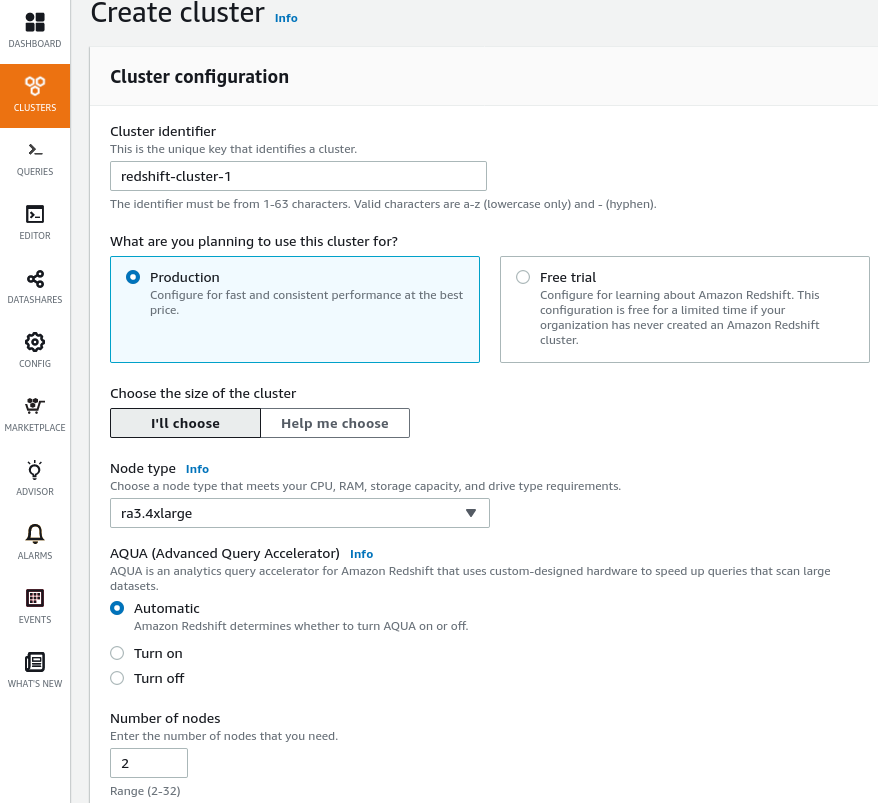

To make the database accessible from outside :

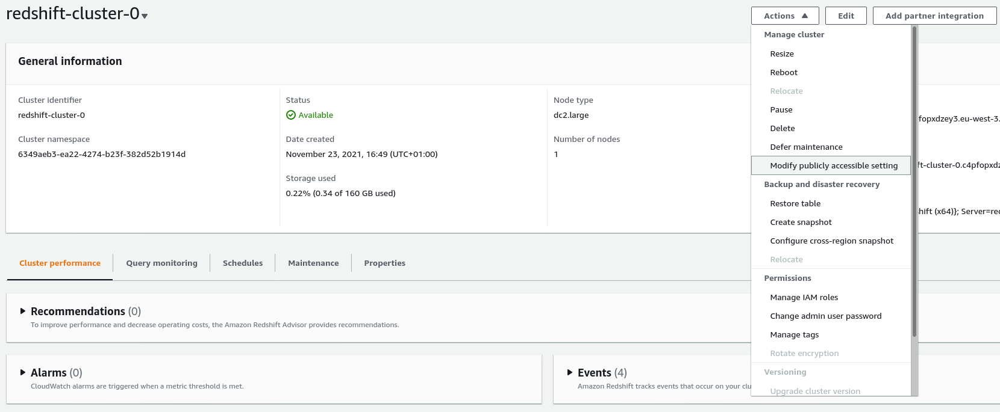

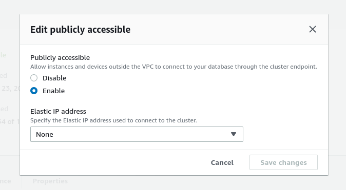

### Installing and configuring Power BI Desktop

### Connect Power BI to the Amazon Redshift database in Power BI Desktop

https://docs.microsoft.com/en-us/power-bi/connect-data/desktop-connect-redshift

1. Launch Power BI Desktop **As an Administrator**.   

	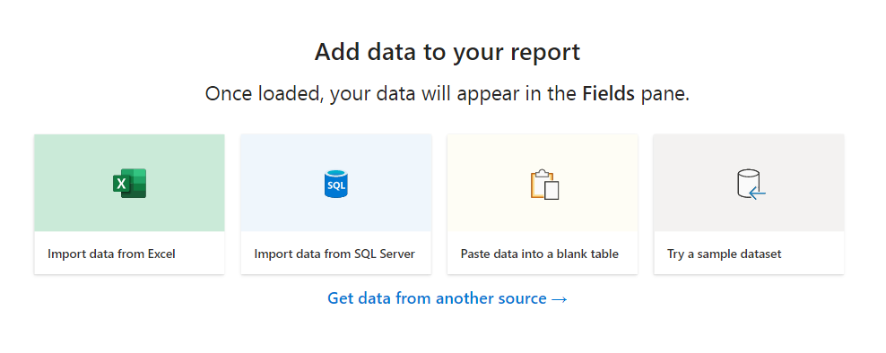

2. Select Home > Get Data > More > Database > Amazon Redshift.   

	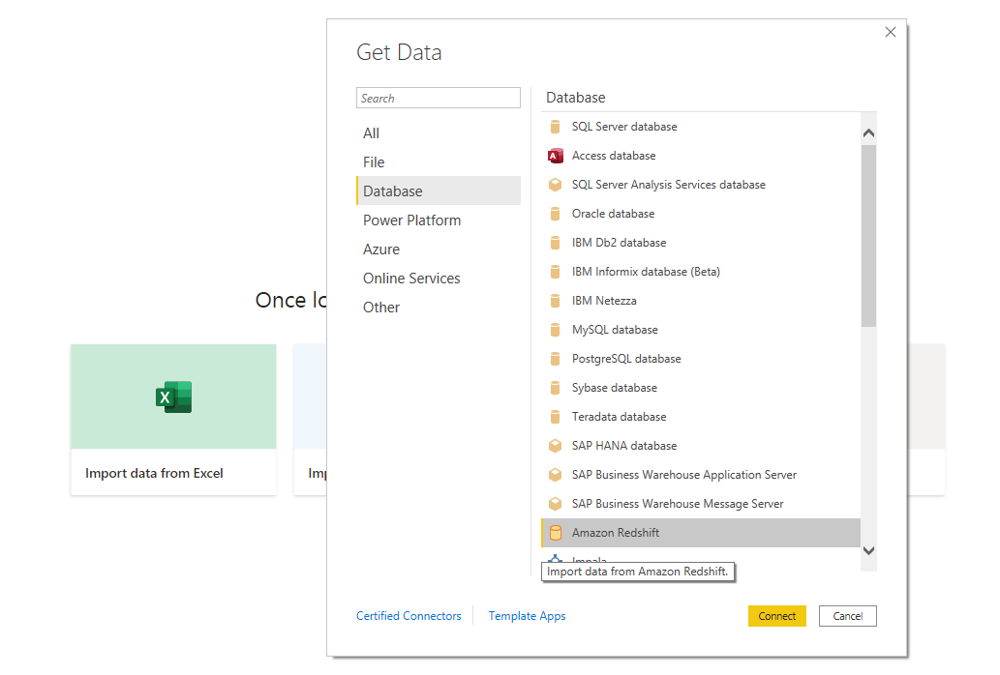

3. Click Connect.   

4. On the next screen, provide the following values:    
Server : copy the value of the key [RedshiftClusterEndpoint], which is found in the CloudFormation Stack Outputs tab 
> redshift-cluster-0.c4pfopxdzey3.eu-west-3.redshift.amazonaws.com:5439

Database : dev (or whatever name you gave for the database) 
> dev

Data Connectivity Mode : Import  

	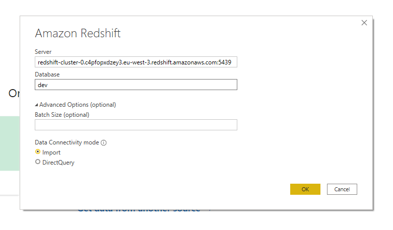

5. If this is the first time you’re connecting to this cluster, then you’ll need to type the Redshift credentials provided earlier. Type in your Redshift username and password in the popup window and click on Connect.    

	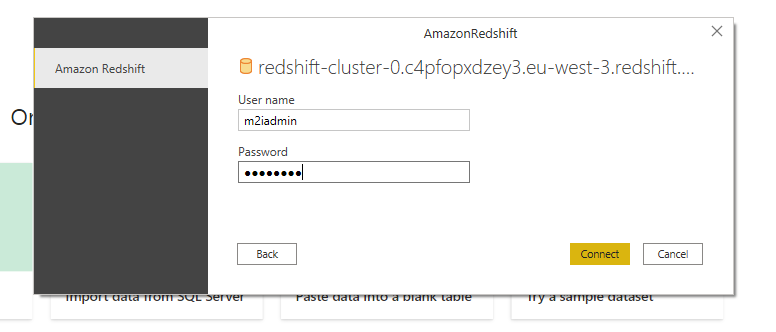

6. Select the following tables from the Navigator window and then click **Load**.    
   -  orders
   -  lineitem
   -  part   

	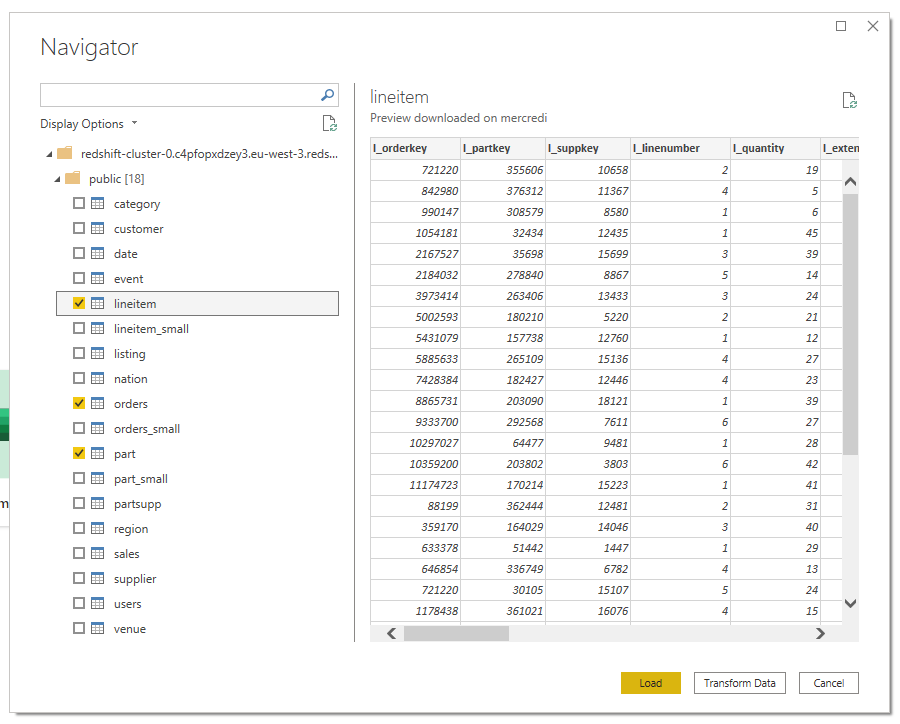

	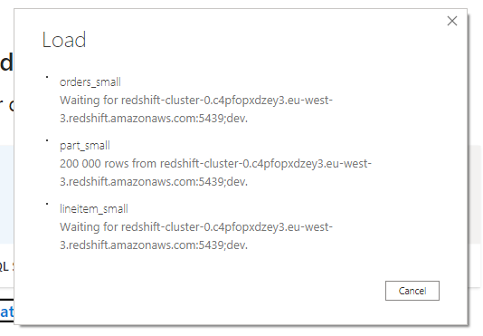

7. First, let's discover the data. Switch Power BI to **data** mode in the left toolbar.

	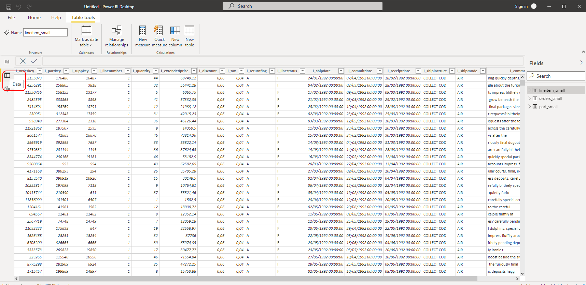

8. Once the data has finished loading, you will need to define table relationships in the in-memory model. 
In Power BI Desktop, change to the Model view by clicking on the “table relationship” icon on the left. 
Create relationships between the tables by dragging and dropping the following columns on each other.  
> o_orderkey = lineitem.l_orderkey  
> p_partkey = lineitem.l_partkey  

	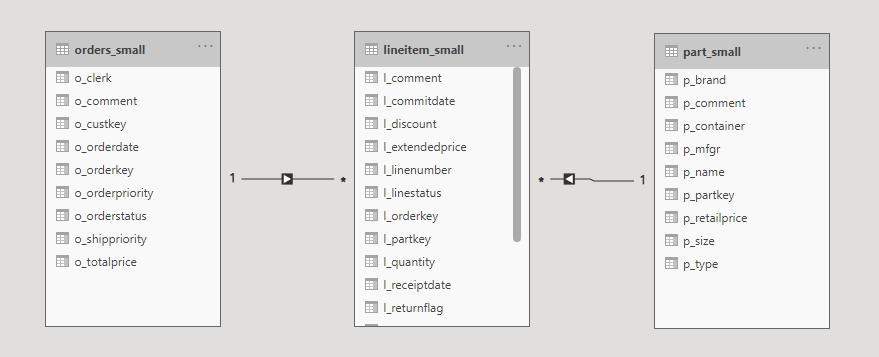

##### Now, you are ready to create some charts. Change to Report view and add the following visualizations to the report :    

9. Date Slicer 
First choose the Slicer chart in the **Visualizations** pane as shown in the following screenshot :
> Visualization type – Slicer 

	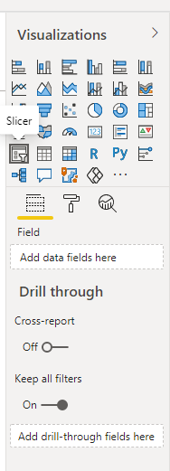

Then select the field to use for the slicer component :
> Field – orders.o_orderdate 

	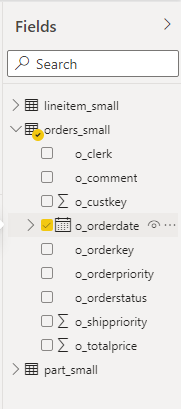

	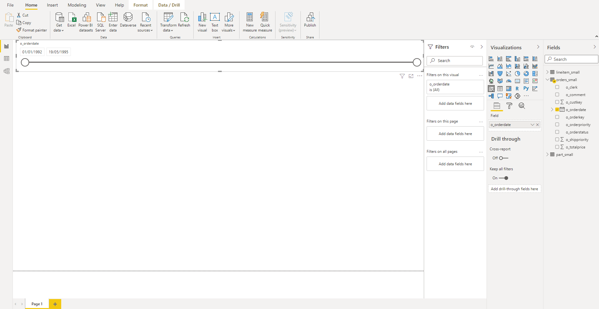

10. Sales by Date by Manufacturer 
> Visualization type – Line Chart 

	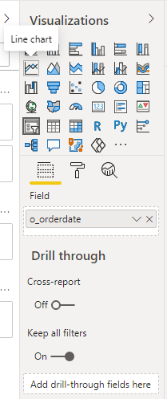

> Axis – orders.o_orderdate 
> Legend – part.p_mfgr 
> Values – lineitem.l_extendedprice 

	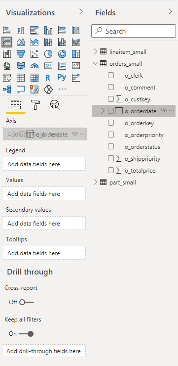

	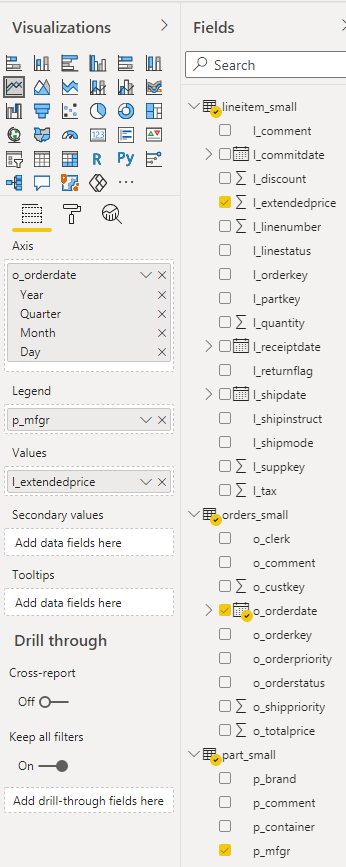

	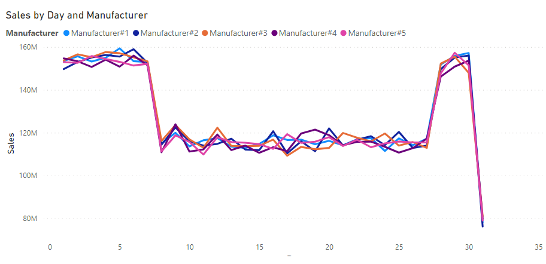

11. Orders by ship mode 
> Visualization type – Pie Chart 

	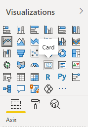

	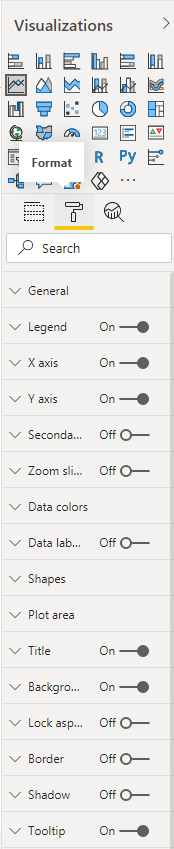

	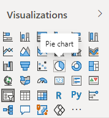

	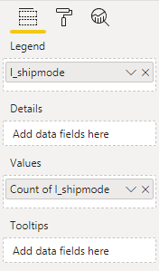

	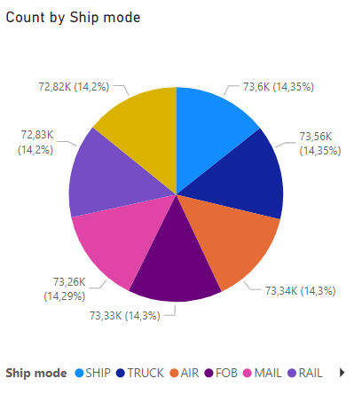

12. Order Count 
> Visualization type – Card 

	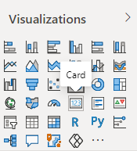

> Fields – Count of orders.o_orderkey 

	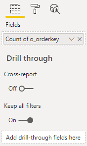

	

13. Line Item Count 
Same as the step 12 with a different field.

> Visualization type – Card 
> Fields – Count of lineitem.l_linenumber 

### The final sales Dashboard should look like this :

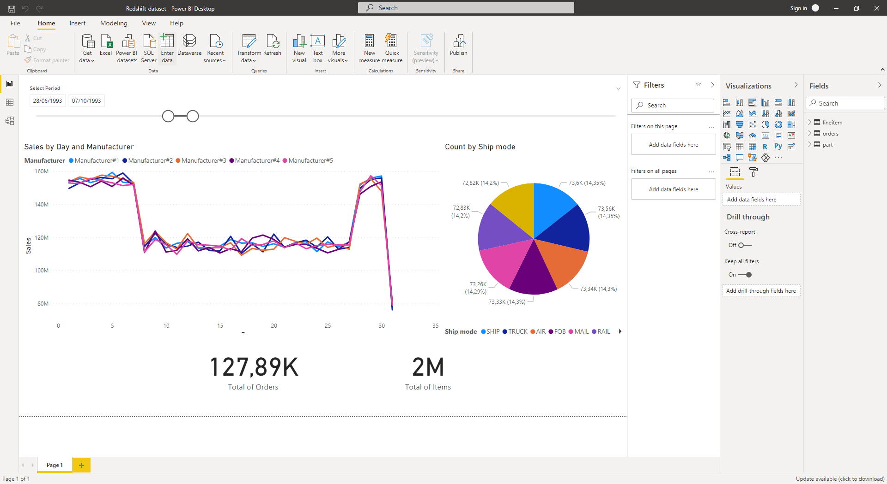

 ✔️
