# Apache Superset

Apache Superset is an open-source software cloud-native application for data exploration and data visualization able to handle data at petabyte scale (big data).<br/>
It is Superset is fast, lightweight, intuitive, and loaded with options that make it easy for users of all skill sets to explore and visualize their data, from simple line charts to highly detailed geospatial charts.

<p align="center">

</p>

## First Part : Install

Apache Superset needs Python 3 so firstable, install Miniconda and use its virtual environment.

```console sbtshell
conda activate
```

Install gcc on AWS EC2 :
```console sbtshell
sudo yum groupinstall "Development Tools"

pip install apache-superset
```

Si erreur :
```console sbtshell
sudo -H pip install --ignore-installed PyYAML
```

Initialisation :
```console sbtshell
superset db upgrade

# Create an admin user in your metadata database (use `admin` as username to be able to load the examples)
export FLASK_APP=superset
superset fab create-admin

# Load some data to play with
superset load_examples

# Create default roles and permissions
superset init
```

## Part Two : Practice

<p align="center">

</p>

### SQLite :

QLite is a relational database management system (RDBMS) contained in a C library. In contrast to many other database management systems, SQLite is not a client–server database engine. Rather, it is embedded into the end program.<br/>
It is embeded wihthin Apache Superset.

##### Data sample :

We provide you with the SQLite sample database named chinook. The chinook sample database is a good database for practicing with SQL, especially SQLite.

The following database diagram illustrates the chinook database tables and their relationships.

<p align="center">

</p>

##### Chinook sample database tables :

There are 11 tables in the chinook sample database :

* **employees** table stores employees data such as employee id, last name, first name, etc. It also has a field named ReportsTo to specify who reports to whom.
* **customers** table stores customers data.
* **invoices** & **invoice_items** tables: these two tables store invoice data. The invoices table stores invoice header data and the invoice_items table stores the invoice line items data.
* **artists** table stores artists data. It is a simple table that contains only the artist id and name.
* **albums** table stores data about a list of tracks. Each album belongs to one artist. However, one artist may have multiple albums.
* **media_types** table stores media types such as MPEG audio and AAC audio files.
* **genres** table stores music types such as rock, jazz, metal, etc.
* **tracks** table stores the data of songs. Each track belongs to one album.
* **playlists** & **playlist_track** tables: playlists table store data about playlists. Each playlist contains a list of tracks. Each track may belong to multiple playlists. The relationship between the playlists table and tracks table is many-to-many. The playlist_track table is used to reflect this relationship.

##### To download the dataset :
```console sbtshell
wget https://www.sqlitetutorial.net/wp-content/uploads/2018/03/chinook.zip
unzip chinook.zip
```

The sample database file is ZIP format, therefore, you need to extract it to a folder, for example, C:\sqlite\db. The name of the file is **chinook.db**.

#####  SQLite Commands :
https://www.sqlitetutorial.net/sqlite-commands/

##### Make databases accessible from Superset :
```console sbtshell
export SUPERSET_CONFIG_PATH=/home/ec2-user/.superset/superset_config.py

nano /home/ec2-user/.superset/superset_config.py
PREVENT_UNSAFE_DB_CONNECTIONS = False
```
⚠️ Do not do this in a production environment.

##### Launch Apache Superset :
To start a development web server on port 8088, use -p to bind to another port :
```console sbtshell
superset run -h 0.0.0.0 -p 8088 --with-threads --reload --debugger
```
Apache Superset is launched on port 8088 :heavy_check_mark: <br/>
> http://EC2_INSTANCE_PUBLIC_IP/8088

#####  Import the database into Apache Superset :
URL to use in Superset to import the SQLite database :<br/>
> sqlite:////home/ec2-user/chihookdb

<p align="center">

</p>

##### Create datasets :
To create charts in Apache Superset it is mandatory to create datasets.

* Option 1 : Create a dataset by importing a table from a database.
In the **Datasets** pane within the **Data** section : click on the button at the right of the screen to add a dataset **+ DATASET** and choose a table from an existing database.<br/>
<p align="center">
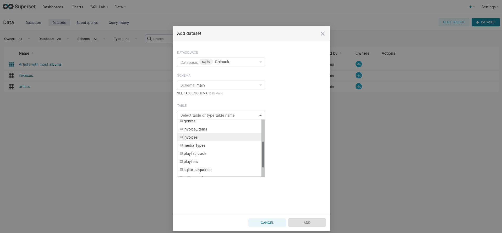
</p>

* Option 2 : Create a dataset from an SQL request in the Apache Superset **SQL Lab**.<br/>
Once the request is done, explore the result and export it as a dataset with the button **EXPLORE** in the toolbar of the results pane.

<p align="center">
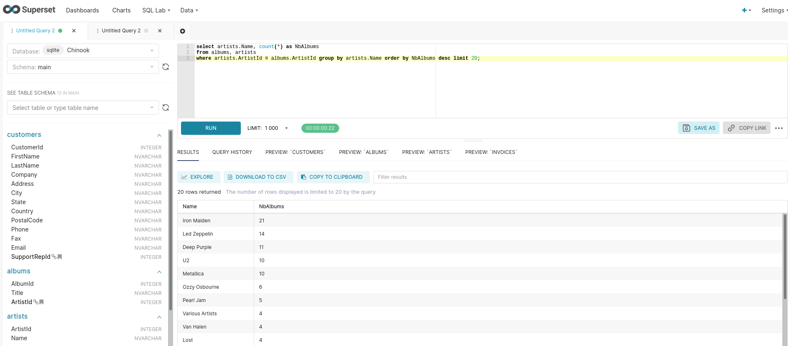
</p>

<p align="center">
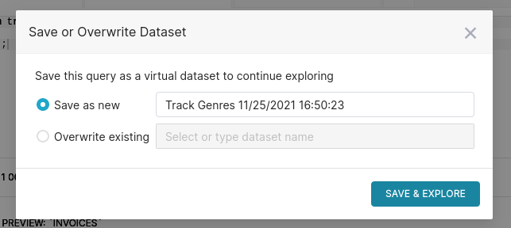
</p>

Now we can see the list of the existing datasets within the **Datasets** pane in the the **Data** section :

<p align="center">

</p>

3. Create a dataset and a chart to visualize the artists with the biggest number of albums :

Write a SQL request to retrieve them and add the result as a dataset.
Once the dataset created, edit it to configure and create a chart :
<p align="center">
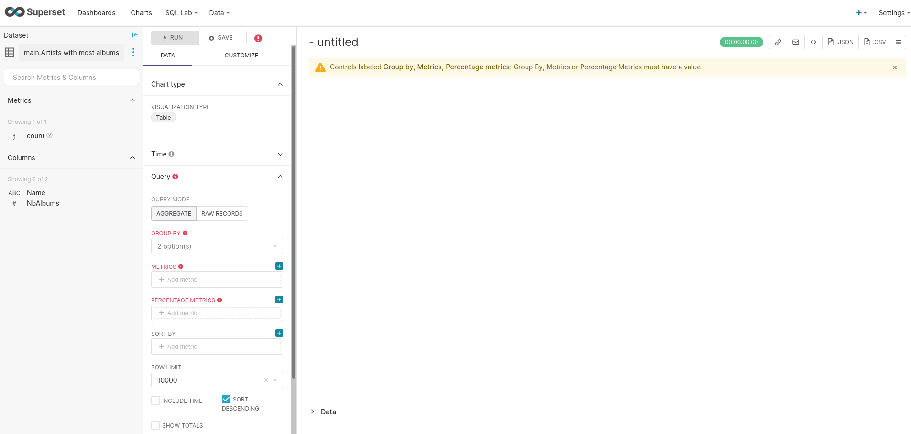
</p>

Click on **VISUALIZE TYPE** and select **Bar Chart** :
<p align="center">
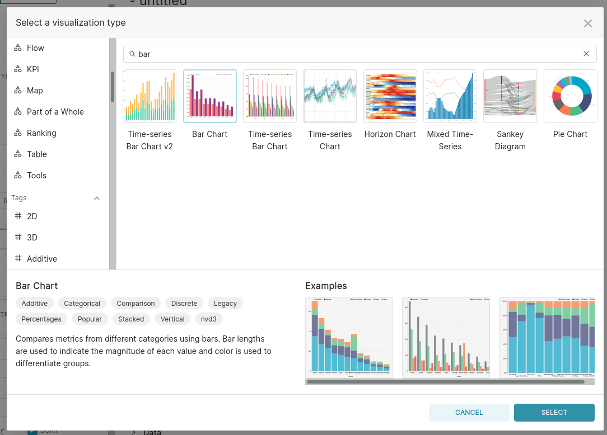
</p>

Now configure the chart by setting :
* The metrics as the Number of albums.
* The series as the Name of the artists. 
<p align="center">
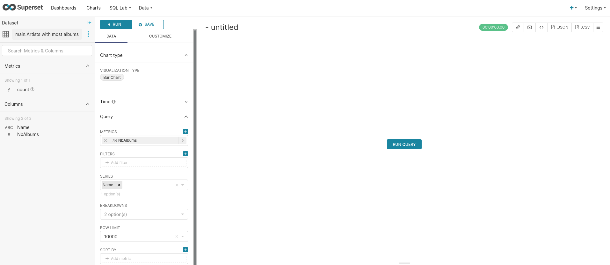
</p>

Visualize the chart and save it by clicking on **+ SAVE** :
<p align="center">
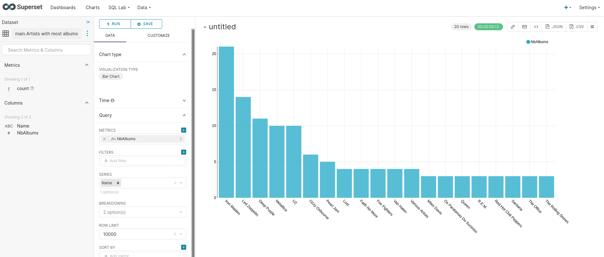
</p>

4. Create a pie chart to visualize the distribution of the invoices by countries :

Choose the dataset for the chart : **main.invoices**.<br/>
<p align="center">
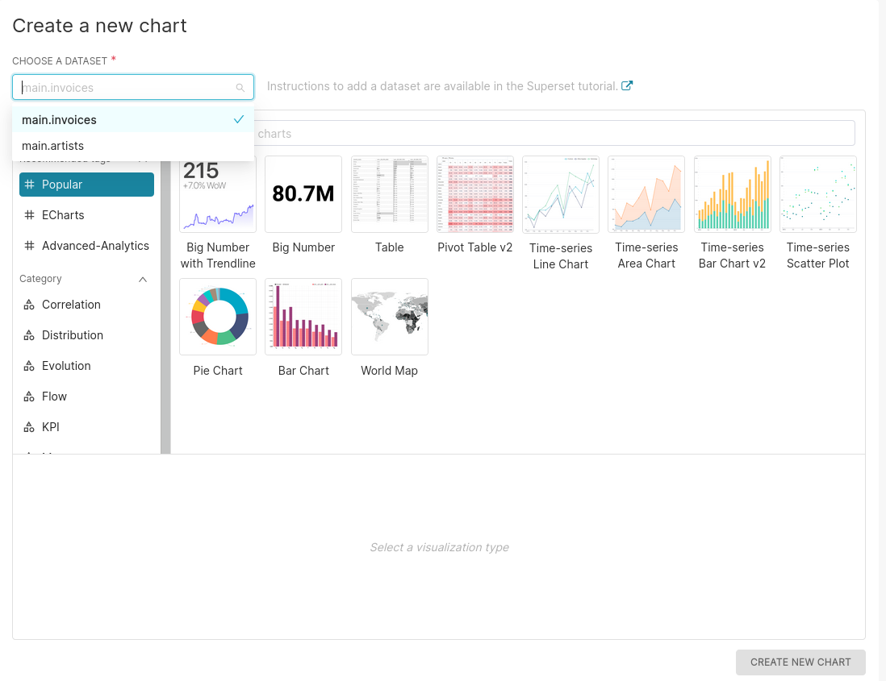
</p>

Select the type of the chart :
<p align="center">
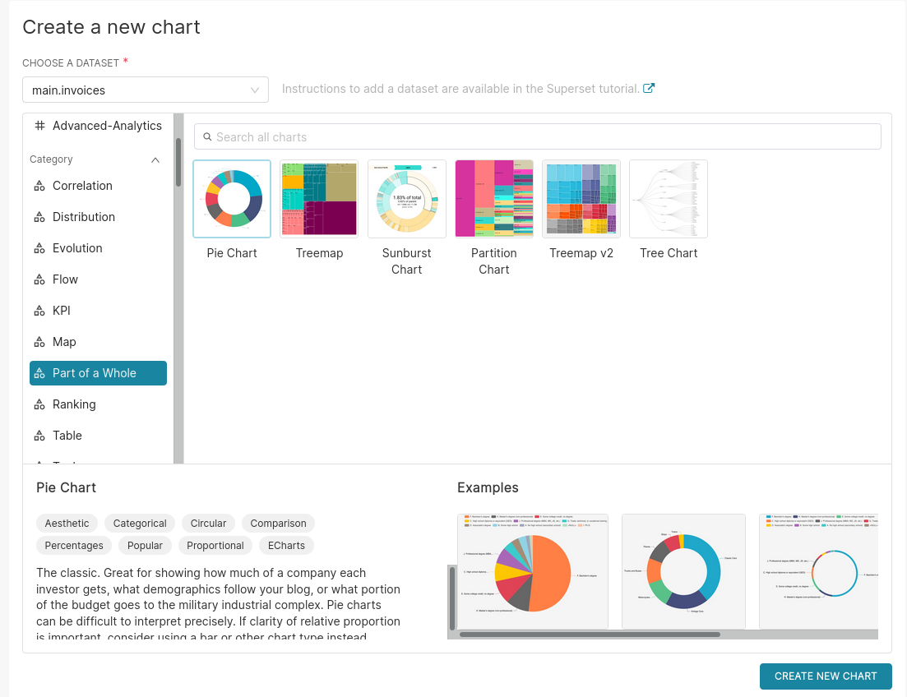
</p>

Now configure the chart by setting :
* The aggregation **GROUP BY** as the Billing country.
* The metric as the count of the invoices. 
<p align="center">
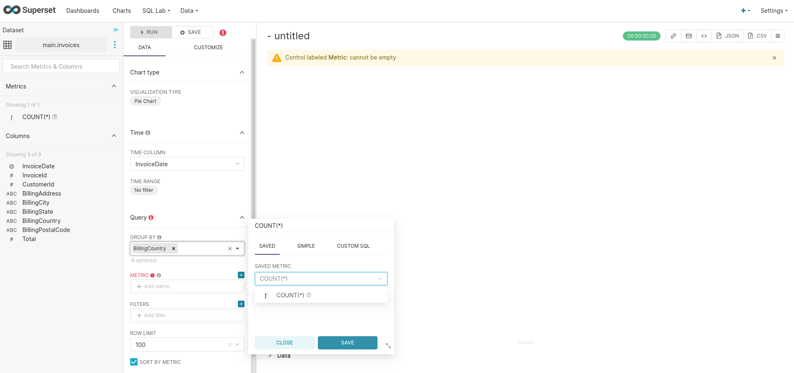
</p>

Visualize the chart and save it by clicking on **+ SAVE** :
<p align="center">

</p>

5. Create a dashbord with the previously created charts :
Go to the Dashboards pane and create a new dashboard by clicking on the button **+ DASHBOARD**.
<p align="center">
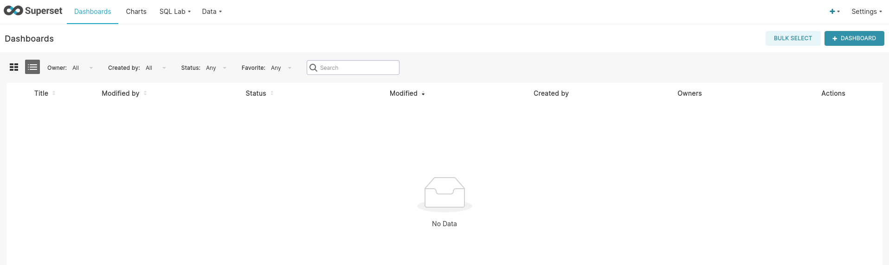
</p>

From the **CHARTS** tab in the right panel, drag the charts to drop on the dashboard.<br/>
<p align="center">
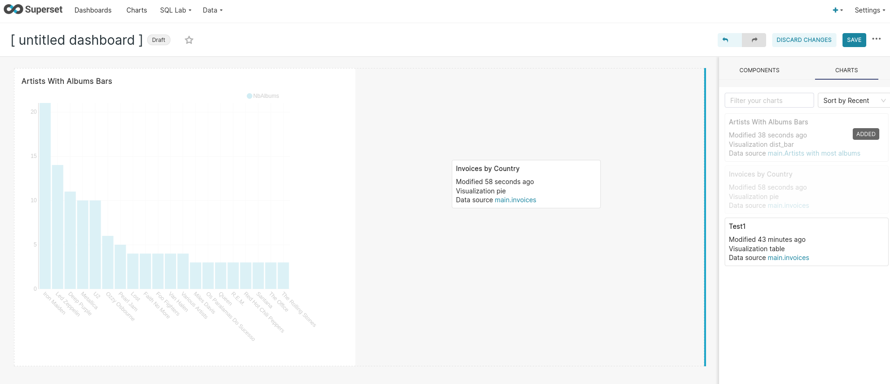
</p>
<p align="center">
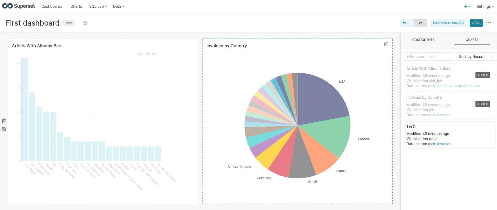
</p>

6. Create a map chart to visualize the distribution of invoices in the world :
Select the dataset **main.invoices** when creating the chart and select **World Map** chart.

Now configure the chart by setting :
* The country column as the Billing country.
* The country field type as the Full name of the country.
* The metric as the count of the invoices.

<p align="center">
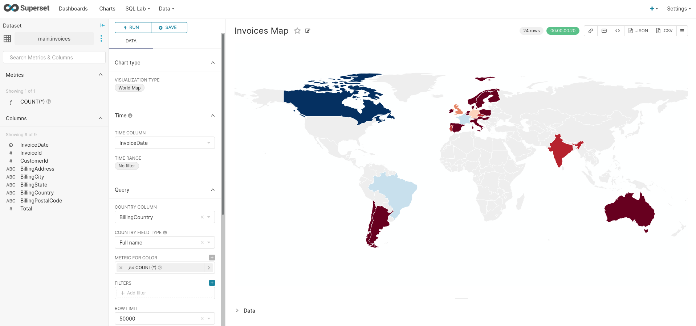
</p>

7. Create a line chart to visualize the evolution of births by in the world since 1965.<br/>
First show the complete evolution then split by gender.<br/>
<p align="center">
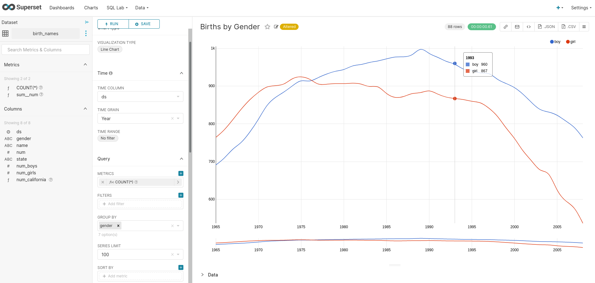
</p>

##### Useful scripts :

```console sql
select artists.Name, count(*) as NbAlbums 
from albums, artists 
where artists.ArtistId = albums.ArtistId group by artists.Name order by NbAlbums desc limit 20;

select * from albums;

select genres.Name from tracks, genres where tracks.GenreId = genres.GenreId;

select genres.Name, count(*) as NbGenres from tracks, genres where tracks.GenreId = genres.GenreId group by genres.Name order by NbGenres desc;
```
