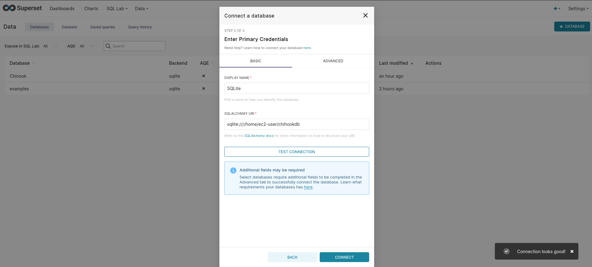
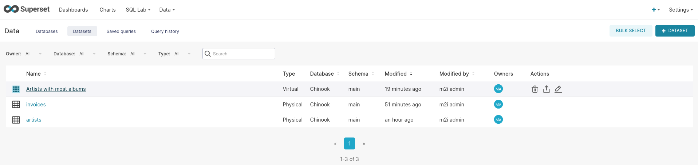
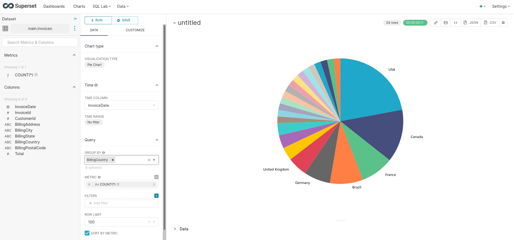

# Apache Superset :

⚠️ Nécessite Python 3.

```console sbtshell
conda activate
```

Install gcc on AWS EC2 :
```console sbtshell
sudo yum groupinstall "Development Tools"

pip install apache-superset
```

Si erreur :
```console sbtshell
sudo -H pip install --ignore-installed PyYAML
```

Initialisation :
```console sbtshell
superset db upgrade

# Create an admin user in your metadata database (use `admin` as username to be able to load the examples)
export FLASK_APP=superset
superset fab create-admin

# Load some data to play with
superset load_examples

# Create default roles and permissions
superset init

# To start a development web server on port 8088, use -p to bind to another port
superset run -h 0.0.0.0 -p 8088 --with-threads --reload --debugger
```

### SQLite :

Embeded wihthin Apache Superset :

Data sample :
https://www.sqlitetutorial.net/sqlite-sample-database/
```console sbtshell
wget https://www.sqlitetutorial.net/wp-content/uploads/2018/03/chinook.zip
```

#####  SQLite Commands :
https://www.sqlitetutorial.net/sqlite-commands/

Make databases accessible from Superset :
```console sbtshell
export SUPERSET_CONFIG_PATH=/home/ec2-user/.superset/superset_config.py

nano /home/ec2-user/.superset/superset_config.py
PREVENT_UNSAFE_DB_CONNECTIONS = False
```
Launch Apache Superset :
```console sbtshell
superset run -h 0.0.0.0 -p 8088 --with-threads --reload --debugger
```
⚠️ Apache Superset is launched on port 8088

URL to use in Superset to import the SQLite database :<br/>
> sqlite:////home/ec2-user/chihookdb

1. On importe une base de données.

2. Pour créer des charts :
* Option 1 : On importe un dataset à partir d'une table.
* Option 2 : Créer un dataset à partir d'une requête SQL.

<p align="center">

</p>
<p align="center">

</p>
<p align="center">

</p>
<p align="center">

</p>
<p align="center">

</p>
<p align="center">

</p>
<p align="center">

</p>
<p align="center">

</p>
<p align="center">

</p>
<p align="center">

</p>
<p align="center">

</p>
<p align="center">

</p>
<p align="center">

</p>
<p align="center">

</p>
<p align="center">

</p>
<p align="center">

</p>
<p align="center">

</p>
<p align="center">

</p>
<p align="center">

</p>
<p align="center">

</p>

##### Useful scripts :

```console sql
select artists.Name, count(*) as NbAlbums 
from albums, artists 
where artists.ArtistId = albums.ArtistId group by artists.Name order by NbAlbums desc limit 20;

select * from albums;

select genres.Name from tracks, genres where tracks.GenreId = genres.GenreId;

select genres.Name, count(*) as NbGenres from tracks, genres where tracks.GenreId = genres.GenreId group by genres.Name order by NbGenres desc;
```
